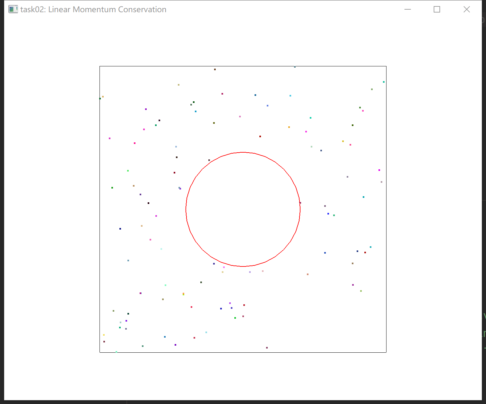
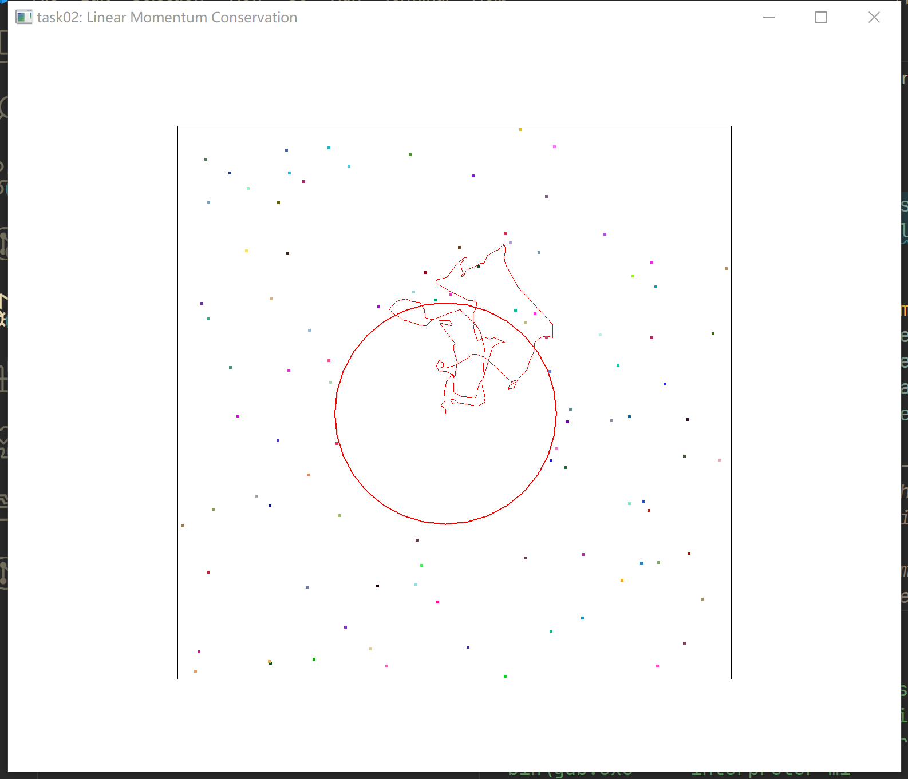

# Task02: Linear Momentum Conservation 

**Deadline: March 4th (Thu) at 15:00pm**

----

## Before Doing Assignment

If you have not done the [task00](../task00), do it first to set up the C++ graphics development environment.

Follow [this document](../doc/submit.md) to submit the assignment, In a nutshell, before doing the assignment,

- install `eigen` library following  [this document](../doc/setup_eigen.md)
- make sure you synchronized the `main ` branch of your local repository  to that of remote repository.
- make sure you created branch `task02` from `main` branch.
- make sure you are currently in the `task02` branch (use `git branch -a` command).

Now you are ready to go!

---

## Problem 1

1. Build the code using `cmake`
2. Run the code
3. Take a screenshot image (looks like image at the top)
4. Save the screenshot image overwriting `task02/problem1.png`

You will see many particles bump into a ball.

## Problem 2

Let's simulate [Brownian motion](https://en.wikipedia.org/wiki/Brownian_motion).  

Follow the instruction at `line #49`  in [main.cpp](main.cpp) to modify the code to simulate the collision between the ball and a particle. 

After running the program for a while, save the screenshot image overwriting `task02/problem2.png`

For the conservation of movement energy, we have:
$$
m_1v_1^2 + m_2v_2^2  = m_1v_1'^2 +  m_2v_2'^2 
$$

and it can be written into

$$
m_1(v_1+v_1')(v_1-v_1') = m_2(v_2+v_2')(v_2'-v_2)
$$

From the conservation of momentum, we have:

$$
m_1v_1 + m_2v_2  = m_1v_1' +  m_2v_2' 
$$

So, we can derive

$$
v_1+v_1' = v_2+v_2'
$$

Now let's write the impulse $I$:

$$
I = m_1(v_1'-v_1)
$$

and also notice that the impulse has a opposite direction for object $m_2$.

$$
-I = m_2(v_2'-v_2)
$$

Since $v_1'$ and $v_2'$ are unknown, and $v_1$ and $v_2$ are known, we can use $I, v_1, v_2$ to represent $v_1'$ and $v_2'$:

$$
v_1' = v_1 + I/m_1
$$

$$
v_2' = v_2 - I/m_2
$$

Plug those two values into $v_1+v_1' = v_2+v_2'$, we have

$$
I/m_1 + I/m_2 = 2(v_2-v_1)
$$

hence

$$
I = {2m_1m_2\over m_1+m_2} (v_2-v_1)
$$

For there is no friction in the tangent plane, only velocity in the normal direction could have force effect.

$$
I_{\text{norm}} = I \cdot n \cdot |n|
$$
where $n$ is the normal vector of the tangent plane.

## After Doing the Assignment

After modifying the code, push the code and submit a pull request.

## Notes

- Do not submit multiple pull requests. Only the first pull request is graded
- Do not close the pull request by yourself. The instructor will close the pull request
- If you mistakenly merge the pull request, it's OK, but be careful not to merge next time. 

